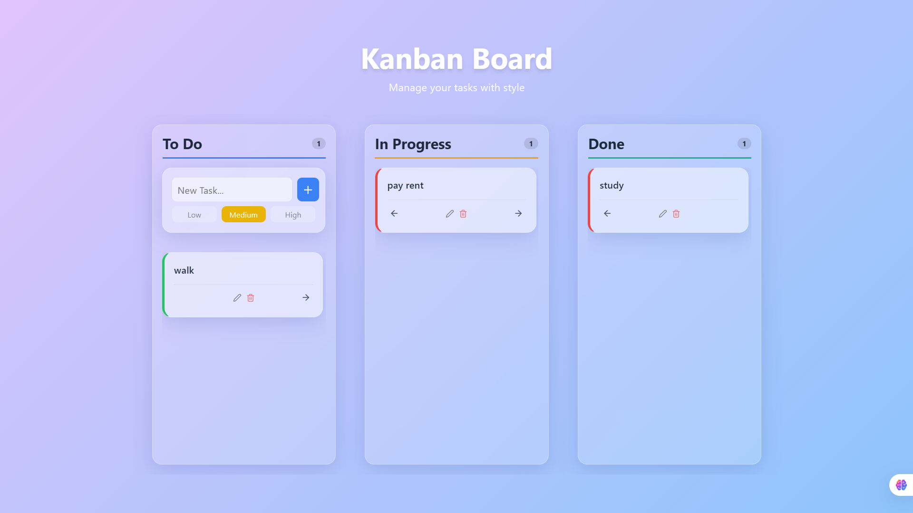

# Kanban Dashboard

A modern, responsive Kanban board application built with React and JavaScript for efficient task management.

[](https://vercel.com/new/clone?repository-url=https%3A%2F%2Fgithub.com%2Fyour-username%2FKanban-Dashboard)

[](https://your-username.github.io/Kanban-Dashboard/)

## 📸 Screenshots



## 🚀 Features

- **Task Management**: Create, read, update, and delete (CRUD) tasks effortlessly.
- **Board Columns**: Organize tasks into "To Do", "In Progress", and "Done" columns.
- **Status Transitions**: Easily move tasks between columns with intuitive controls.
- **Local Storage Persistence**: Your tasks are saved automatically and restored when you return.
- **Responsive Design**: A seamless experience across desktop and mobile devices.

## 🛠️ Tech Stack

- **[React](https://react.dev/)**: For building the user interface.
- **[JavaScript](https://developer.mozilla.org/en-US/docs/Web/JavaScript)**: The programming language of the web.
- **[Vite](https://vitejs.dev/)**: For fast development and optimized builds.
- **[Lucide React](https://lucide.dev/)**: For beautiful and consistent icons.

## 📦 Installation & Getting Started

Follow these steps to set up the project locally:

1.  **Prerequisites**: Ensure you have Node.js installed on your machine.

2.  **Clone the repository**:

    ```bash
    git clone <repository-url>
    cd Kanban-Dashboard
    ```

3.  **Install dependencies**:

    ```bash
    npm install
    ```

4.  **Run the development server**:

    ```bash
    npm run dev
    ```

5.  **Build for production**:
    ```bash
    npm run build
    ```

## 📂 Project Structure

- `src/components`: Contains UI components like `Board`, `Column`, `TaskCard`, and `TaskForm`.
- `src/hooks`: Custom hooks, including `useTasks` for managing task state and local storage.
- `src/utils`: Utility functions.
- `src/App.jsx`: The main application component.
- `src/main.jsx`: The entry point of the application.

## 🤝 Contributing

Contributions are welcome! Please feel free to submit a Pull Request.

## 📄 License

This project is open source and available under the [MIT License](LICENSE).
